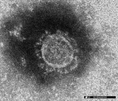

このブログ最初のトピックは、コロナウイルスです。大学院でウイルス学を専門としていたため、最初に書きたいトピックでした。

これから何回かに分けて、コロナウイルスの解説をしつつ、今注目されているアビガンなどの抗ウイルス薬がどうしてコロナウイルスに効くかもしれないのか解説していきたいと思います。

初回は、コロナウイルスの概要について説明していきます。

科学的な事実と私の考え、推測部分は書き分けたつもりですが、注意しつつお読みください。

 

## **細菌とウイルスの違い**

***

混同されがちな細菌とウイルスですが、両者には大きな違いがあります。それは、**生物か否か**の違いです。

細菌は自分で増殖できる（生物である）のに対して、ウイルスはできません（生物ではない）。

ウイルスは、自分で増えることはできませんから、生き物の細胞に入り込み、その細胞の機能を利用し増殖します。

生き物ではなく物質であるウイルスが、自身を増殖しようと振舞うことが個人的にとても不思議なポイントです。

（ウイルスって面白いですね！）

<u>[利己的な遺伝子](https://ja.wikipedia.org/wiki/利己的遺伝子)</u>って、ウイルス見てると、そうかもしれないなーって結構思います。

 

## **コロナウイルスとは**

***

「コロナウイルス」とは、コロナウイルス科に属するウイルスの総称です。

もちろん、2020年7月現在流行中のCOVID-19の原因の新型コロナウイルスもこれに含まれます。

元々コロナウイルスは風邪を引き起こすウイルスの一つとして有名でした（~~ウイルス学専攻だったから知ってるだけ~~）。

コロナウイルス科の特徴を2つだけ挙げておきます。

1 . エンベロープを持っている

2 . 一本鎖プラス鎖RNAウイルスである

 

1つ目は、たまにニュースでも流れていたので、知っている人もいるかもしれないですね！アルコールが有効かどうかという話題で出てきていました（エンベロープは結構面白いんですよ、初めてウイルスの勉強したときに「なるほどなー」って思ったのをよく覚えています。次の記事で解説します）。

2つ目の方は、初めて聞いた単語かもしれませんね。意味が分からない人も多いでしょうが、今は「ふーん」って思っといてください。抗ウイルス薬の話になるときにまた出てきます。

 

## **新型コロナウイルスについて**

***

正式名称は、「severe acute respiratory syndrome coronavirus 2」。略称は、「<u>[SARS-CoV-2](https://www.who.int/emergencies/diseases/novel-coronavirus-2019/technical-guidance/naming-the-coronavirus-disease-(covid-2019)-and-the-virus-that-causes-it)</u>」です。

SARSとは、2002年から2003年にかけて中国を中心に流行したコロナウイルス感染症のことで、当時致死率9%をほこりました。

SARSを引き起こしたSARS-CoVとSARS-CoV-2の関係は、親子というより<u>[姉妹に当たる](https://www.biorxiv.org/content/10.1101/2020.02.07.937862v1.full.pdf)</u>ようで、共に**SARS関連ウイルス**に属しています。

ちなみに、一般的な風邪のコロナウイルスは「ヒトコロナウイルスHKU1」に属するウイルスになります。こちらは、**SARS関連ウイルスには分類されていません。**

コロナウイルスの電子顕微鏡写真　出典：国立感染症研究所

 

## **まとめと私見**

***

コロナウイルスについての導入の解説は以上になります。ウイルス分類学上、新型コロナウイルスは風邪の原因のコロナウイルスよりもSARS-CoVに近いもののようです。

私の個人的見解ですが、このウイルス分類学的な事実からも「コロナはただの風邪」ではないと言っていいのではないかと思います。

あと最後に、ウイルスの分類が分かると何が良いのかという点について、私の意見を追記しておきます。

人間と同じようにウイルスも親子・姉妹関係では似た性質を持っています。つまり、新型コロナウイルスがSARS-CoVと似ていると分かったということは、これまでのSARS-CoVの知見も参考にできるということです。これは全く未知のウイルスであった場合と比べて、大きな意味があると思います。また今後、新型コロナウイルスと似たウイルスが流行した場合も今回の知見を生かし、より精度の高い予想や予防策を打てるかもしれません。一見、「ウイルスの分類が分かったって誰かの命が救われる訳じゃない」と思えそうですが、実際はとても大事なことかもしれませんね。

次回は、一般的なウイルスの構造の話をしつつ、今回取り上げたコロナウイルスの2つの特徴について詳しく解説していきます。

 

## **小ネタ**

***

コロナウイルスという名称は、表面に存在する突起が王冠(ギリシャ語でコロナ)に似ていることから、名付けられました。

太陽のコロナも同じ由来です。あと、英語の発音は、ウイルスではなく「**ヴァイラス**」です。
