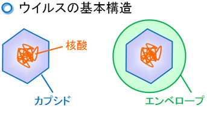

コロナウイルス特集の第2回です。

今回は、コロナウイルスの特徴について説明していきます。

 

## **ウイルスの構造**

***

ウイルスは主に遺伝子、カプシド、スパイク、エンベロープの4つの要素から構成されています。

それぞれの役割は下記の通りになります。

**遺伝子**：ウイルスの設計図。人間の場合は、遺伝子は46本のDNA（デオキシリボ核酸）鎖で構成されていますが、ウイルスの場合は多様で1本の場合もあれば複数本の場合もあります。また、遺伝子の構成要素もDNAの場合もRNA（リボ核酸）の場合もあります。
DNAとRNAの違いについては、今回は触れません。現時点では似たようなものだと思っていてもらえれば結構です。

**カプシド**：ウイルスのたんぱく質でできた殻のこと。

エンベロープ：一部のウイルスの表面にある脂質膜のこと。

スパイク：エンベロープの表面にあるたんぱく質。

このうち、太字の2つ、遺伝子とカプシドは必須の要素です。エンベロープを持っているウイルスにはコロナウイルスの他にもインフルエンザウイルスなどが挙げられます。逆にエンベロープを持たないウイルスにはノロウイルス、アデノウイルスなどが挙げられます。

出典 kusuri-jouhou.com

 

## **コロナウイルスの特徴**

***

前回の記事で、コロナウイルスの特徴を2つ挙げました。「エンベロープを持っている」と「一本鎖プラス鎖RNAウイルスである」です。
では、一つずつ説明していきます。

 

## **エンベロープについて**

***

最初に触れた通り、エンベロープはウイルスの表面にある脂質膜のことです。実はこのエンベロープ、アルコールや石鹸（界面活性剤）で簡単に溶けてしまいます。
これは、脂質がアルコールに溶けやすい性質を持っているためで、エンベロープを溶かされてしまったウイルスは、不活化（ウイルスとして機能できなくなる、死ぬって言ってもいいですかね）してしまいます。

そのため、エンベロープを持っているウイルスは、持たないウイルスよりも簡単に不活化できる訳です。

これだけ聞くと、なんだか弱点増やしているだけに聞こえませんか？でも、**それは違うんです。**

実は、人間も細胞膜など、たくさんの脂質膜を持っています。加えて、なんとウイルスのエンベロープは、人（正確には宿主ですが、ここでは人とします）から獲得したものなんです。つまり、エンベロープを持つとウイルスは、**人の皮を被ったような状態**になるんです。
人の免疫は、巧みに自分以外の侵入者を攻撃します。しかし、この人の皮を被ったウイルスは、どうでしょうか。一見、人の細胞のようにも見える訳です。こうして、エンベロープ持ちのウイルスは、人の免疫から逃れようとします（すごくないですか！？）。

この機構を知ったときには、驚きましたねー。これで生き物じゃないってマジですか。。って思いました。

実際には、エンベロープによる免疫を回避する仕組みは、もっと複雑です。また、このすごい免疫回避術をさらに上回る免疫機構もある訳です（これもすごい）。

 

## **「一本鎖プラス鎖RNAウイルス」について**

***

「一本鎖プラス鎖RNAウイルス」を「一本鎖」「プラス鎖」「RNAウイルス」の3つに分解して説明していきます。

まずは、一番説明しやすい「RNAウイルス」から。これは、遺伝子がRNAで構成されているウイルスのことを指しています。

次に「一本鎖」。これは、遺伝子が1本のRNA鎖だけであることを指しています。遺伝子（DNA）の二重らせん構造って聞いたことありませんか？こういうやつです。実はこれは2本のDNA鎖が結合しながら、ねじれた構造をしています。
1本鎖とは、このうちの片方しか持っていないということを指しています。

では、その1本は、左右のどっちなのか。この当たりを説明してくれているのが「プラス鎖」です。実は、2本鎖の遺伝子の場合、一方に設計図が載っていて、もう一方には、その設計図の鏡写しのような情報が載っています。
このうち、遺伝情報が載っている方を「プラス鎖」、鏡写しの方を「マイナス鎖」と呼んでいます。

まとめると、「一本鎖プラス鎖RNAウイルス」とは、<u>遺伝子が設計図が載っている方の1本のRNAで構成されているウイルス</u>という意味になります。

## まとめ

今回は、ウイルスの構造に触れつつ、コロナウイルスの2つの特徴について解説してまいりました。生き物ではない小さな粒子であるウイルスですが、結構巧みな仕組みを持っているんですね。

次回は、コロナウイルスへの効果が期待されているアビガンの仕組みを解説しつつ、どうしてコロナウイルスにも効く可能性があるのかを説明していきます。

次回のポイントはコロナウイルスが「RNAウイルス」であるということです。このことを忘れずにいてもらえると嬉しいです。

では、今回はここまで。
