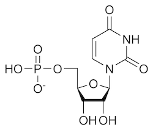
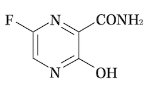
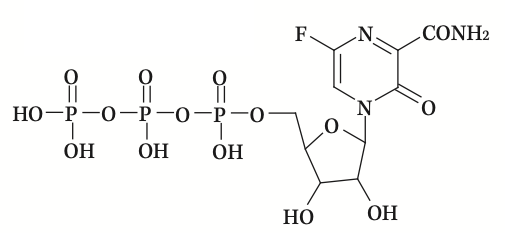
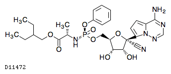

お久しぶりです。随分空いてしまいましたが、コロナウイルスの解説シリーズ3つ目の記事になります。

今回は、アビガンの仕組みについて説明していきます。1本目の記事の段階では、まだアビガンが効果があるか分からない状態でしたが、先日ついに抗コロナウイルス薬として適用される見込みであると言うニュースがありました（明るいニュースですね！）。

ですので、この記事では、アビガンの仕組みを説明しつつ、今後の抗コロナウイルス薬開発の展望について私の予想を書いていこうと思います。

前回の記事で最後に話した通り、コロナウイルスがRNAウイルスであることが大きなポイントになります（RNAウイルスってなんだっけと言う方は、<u>[こちらの記事](/posts/2020-07-co-v-2/)</u>を先に読んでください）。

 

## **アビガンの仕組み**

***

まずは、アビガンの仕組みについて、ざっくり説明していきましょう。

コロナウイルスに限らずウイルスは、細胞に感染し増殖、その後細胞から放出され、また別の細胞に感染するというサイクルを繰り返すことで体内で増殖します。

この増殖する段階では、当然自分のコピーを作成するための部品を細胞内で合成する必要があります。
では、コロナウイルスの場合、遺伝子(一本鎖プラス鎖RNA)、カプシド、エンベロープ、スパイクのそれぞれをどう合成するのか説明していきます。

| 名前 | 説明 |
| ----| ---- |
| 遺伝子 | RNAは細胞内にあるものを利用する。 RNAを繋げて一本鎖（遺伝子）を作る作業はウイルス自身が持っている**RNAポリメラーゼと呼ばれる酵素**で行う。 |
| カプシド スパイク | 設計図は遺伝子だが、合成はヒトの酵素を利用して行う。|
|エンベロープ | 前回の記事の通り、細胞から放出されるタイミングで細胞の膜を拝借する。|

アビガンは、このうち遺伝子の合成に関わるRNAポリメラーゼの機能を阻害します。つまり、ウイルスを殺す（無力化する）と言うより、**増殖を抑える抗ウイルス作用**を持った薬と言えます。

それでは、具体的にどうやってRNAポリメラーゼを阻害しているか説明していきます。

 

## **RNA鎖の構造**

***

まずはRNAの構造をご覧ください。こちらはRNAの一つのウラシルの構造になります。

ここまで説明していませんでしたが、RNAは塩基（上図の右上の六角形の部分）の違いによって4種類存在します。（つまり遺伝子って、たった4つの文字で書かれている。すごい。）

残りの塩基は下記の3つです。左から順に、アデニン、シトシン、グアニンになります。

 

## **アビガンの構造と詳しい仕組み**

***

それでは次にアビガンの構造を見てみましょう。

少し塩基に似ていませんか。
さらにアビガンの活性体（体内で化学反応した後の薬として効果を発揮する形）ではこうなります。

どうですか、RNAにかなり似ていませんか？実はアビガンはRNAを模した薬なんです。

RNAポリメラーゼはRNAを一つずつ取り込み、繋げることでRNA鎖を延ばしていきます。このとき、構造が似ているアビガンを見分けることができず、RNAと同様取り込んでしまいます。ただ、取り込まれたアビガンではRNA鎖を延ばせず、RNA鎖（ウイルス遺伝子）の延長がそこでストップします。
アビガンによってコロナウイルス遺伝子（RNA鎖）が作られなくなると、遺伝子を設計図にして作られるたんぱく質（カプシドやスパイク）も作られなくなり、ウイルス自体の増殖もストップします。
これが、アビガンが抗ウイルス薬として働く仕組みです。

 

ここで、一つ重要な説明をしておきます。実はヒトもRNAポリメラーゼを持っています。そして、このヒトのRNAポリメラーゼは体内で重要な働きをしているため、阻害されてしまうと大問題です。
アビガンは、この問題を避けるために**インフルエンザウイルス（アビガンは本来抗インフルエンザ薬）のRNAポリメラーゼは阻害するが、ヒトのRNAポリメラーゼは阻害しない**よう設計されています。

ちなみに同じウイルスRNAポリメラーゼ阻害薬で、抗エボラ出血熱ウイルス薬であるレムデシビルは以下のような構造をしています。アビガンの活性体と同様にRNAと似た構造をしていますね。
アビガン活性体とレムデシビルは多少異なる構造をしていますが、これはそれぞれがインフルエンザとエボラウイルスのRNAポリメラーゼを効率良く阻害するよう工夫されていることに因ります。

 

アビガンは、インフルエンザのRNAポリメラーゼを阻害するよう作られた薬であり、コロナウイルスのRNAポリメラーゼに対しても効くよう意図して設計されていません。
それがなぜ抗コロナウイルス薬になりそうかというと、詰まるところ調べてみたら「たまたまコロナウイルスのRNAポリメラーゼ阻害作用も持ちあわせていた」というところです。
ただ、コロナウイルス、インフルエンザウイルス（、エボラウイルス）はいずれもRNAウイルスであり、自身のRNAポリメラーゼを持ったウイルスです。
分類学上は全く異なりますが、そういう面では比較的共通点の多いウイルス同士で、アビガンは効くかもしれないという予想は流行当初から立っていたかもしれませんね。

 

## **まとめと今後の展望の予想**

***

今回は、アビガンの構造を見ながら、その作用について説明していきました。RNAを真似ることでRNA鎖を作らせないという仕組み、本当に良く考えられているなと感心してしまいますね。
実は、このアビガンのように、とある物質と似ているけど違う構造を取ると言うのは、薬の常套手段です。よかったら、他の薬についても調べてみてください。

 

さてここからは、今後の抗コロナウイルス薬の展望の私の予想になります。あくまで予想になりますので、話半分で聞いてください。

今回コロナウイルスに対するアビガンの有効性が証明された(される)ということで、RNAポリメラーゼ阻害薬が抗コロナウイルス薬になることが明らかになりました。
一方で、アビガンはあくまでインフルエンザに特化した薬であり、コロナウイルスに特化されたものではないこともほぼ間違いない事実ではないかと思います。
そこで私は、今後の展開としてはアビガンの構造を元にさらに抗コロナウイルス薬に特化した薬が開発されることになるのではと予想しています。

ただ、新しく開発される薬は、アビガンとは異なり、毒性試験など安全性面の確認がまだ行われていません。アビガンですら1年近くかかりましたから、今から開発された場合、それ以上の時間がかかる事は明白です。
スピード感を持って開発が進められていると思いますが、本格的な抗コロナウイルス薬が発売されるのは数年先になるのではないでしょうか。

それまでは、アビガンで我慢ですね。アビガンが効かなかった（RNAポリメラーゼ阻害薬がコロナウイルスに有効が分からなかった）場合のことを思えば、本格的な抗コロナウイルス薬までの道筋が見えている分、今はずいぶんマシと言えるでしょう。
